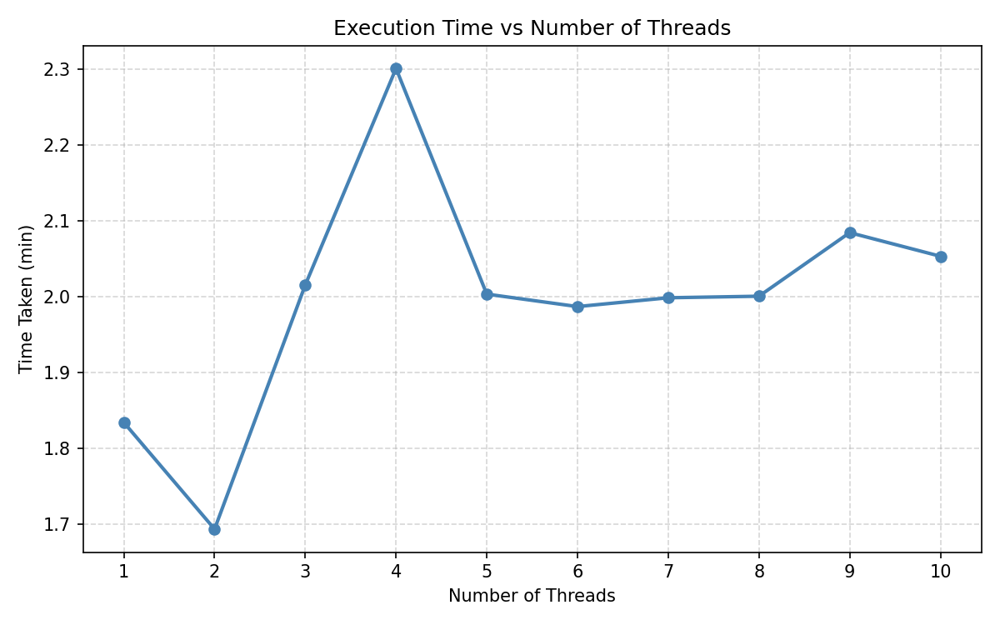
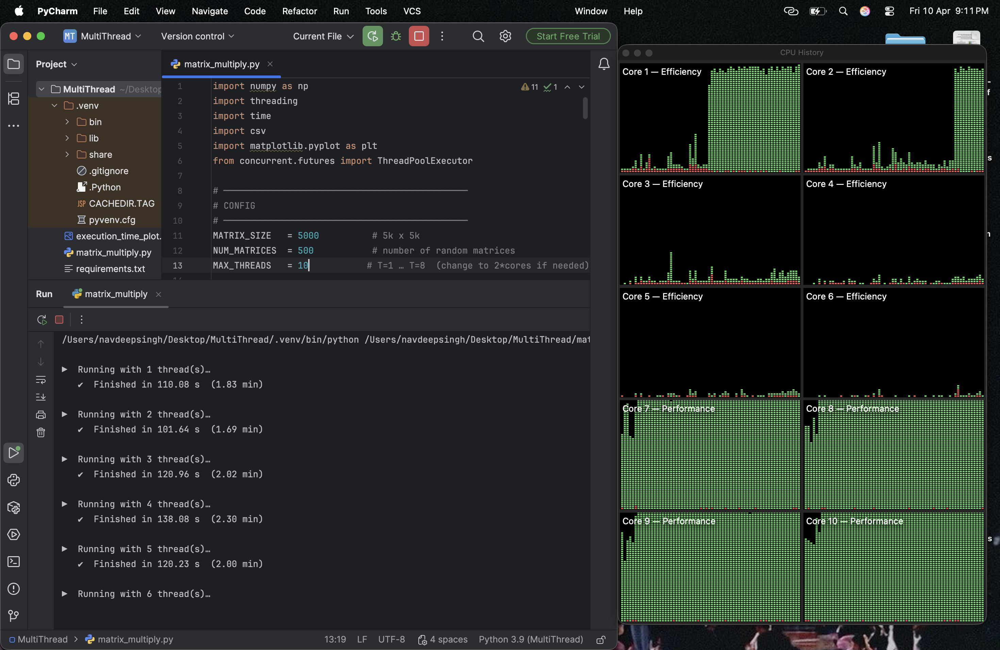
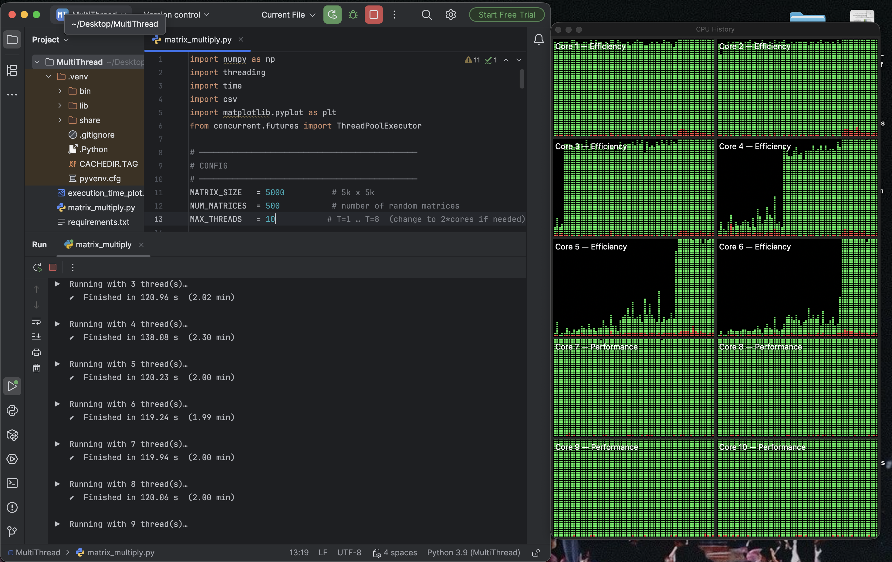
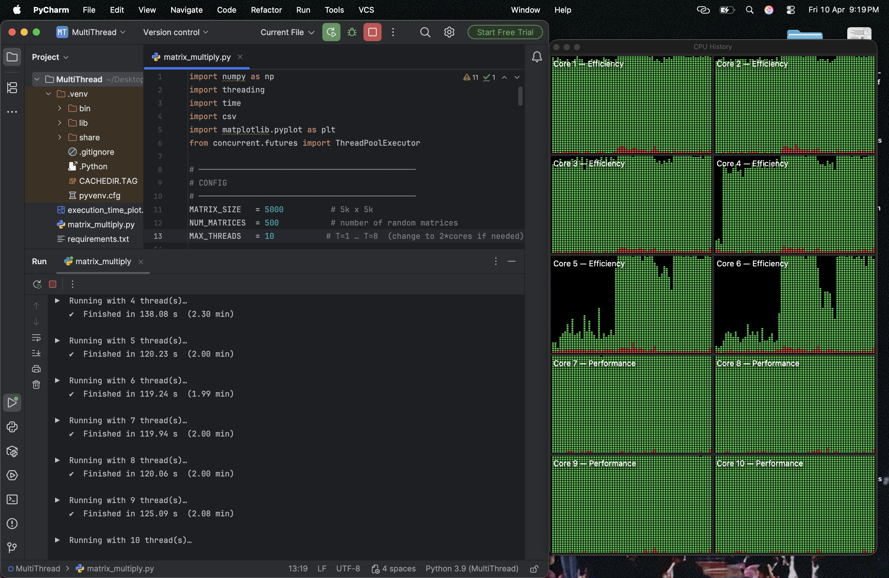

# 🧵 Multi-Threaded Matrix Multiplication


---

## 📌 Overview

This project demonstrates the impact of **multi-threading** on computational performance by multiplying **500 random matrices of size 5000 × 5000** with a single constant matrix of the same size.

The experiment was conducted on an **Apple MacBook Air M4** with **10 CPU cores** (6 Efficiency + 4 Performance), running Python's `ThreadPoolExecutor` for thread management and `NumPy` for optimized matrix operations.

---

## 🎯 Objective

> Multiply 500 random matrices (5k × 5k) with a constant matrix (5k × 5k) using varying numbers of threads (T=1 to T=10), record execution time, and analyze the effect of parallelism on performance.

---

## 🖥️ System Specifications

| Property | Details |
|---|---|
| **Device** | MacBook Air M4 |
| **CPU Cores** | 10 (6 Efficiency + 4 Performance) |
| **OS** | macOS |
| **Python Version** | 3.9 |
| **IDE** | PyCharm |
| **Key Libraries** | NumPy, Threading, Matplotlib |

---

## 📁 Project Structure

---

MultiThreading-/
├── matrix_multiply.py        # Main script with threading logic
├── visualize.py              # Graph generation script
├── execution_time_plot.png   # Auto-generated performance graph
├── results.csv               # Raw timing data
├── T4.png                    # CPU History screenshot at T=4
├── T8.png                    # CPU History screenshot at T=8
├── T10.png                   # CPU History screenshot at T=10
└── README.md

## ⚙️ How It Works

1. A **constant matrix** (5000×5000) is generated once and shared across all threads
2. Each worker thread generates a **random matrix** (5000×5000) and performs `np.dot()` with the constant matrix
3. The experiment is repeated for thread counts **T=1 through T=10**
4. Execution time is recorded, saved to CSV, and plotted

```python
# Core logic
def multiply_worker(index):
    random_matrix = np.random.rand(MATRIX_SIZE, MATRIX_SIZE).astype(np.float32)
    _ = np.dot(random_matrix, CONSTANT_MATRIX)

with ThreadPoolExecutor(max_workers=num_threads) as executor:
    futures = [executor.submit(multiply_worker, i) for i in range(NUM_MATRICES)]
```

---

## 📊 Results

### Timing Table

| Threads | T=1 | T=2 | T=3 | T=4 | T=5 | T=6 | T=7 | T=8 | T=9 | T=10 |
|---|---|---|---|---|---|---|---|---|---|---|
| **Time (sec)** | 110 | 101 | 120 | 138 | 120 | 119 | 119 | 120 | 125 | 123 |

> 📝 Fill in your actual recorded times from `results.csv`

---

### 📈 Execution Time Graph



> The graph shows a **U-shaped curve** — performance improves as threads increase up to the optimal point (matching physical core count), after which overhead causes performance to degrade.

---

### 🖥️ CPU Usage — T=4 Threads


> At T=4, primarily the **Efficiency cores** are engaged, with moderate utilization spread across cores 1–4.

---

### 🖥️ CPU Usage — T=8 Threads


> At T=8, both **Efficiency and Performance cores** are active, showing significantly higher and more distributed CPU utilization.

---

### 🖥️ CPU Usage — T=10 Threads


> At T=10 (2 × number of physical cores), **all 10 cores** are visible in the CPU History, demonstrating full hardware engagement. Execution time increases slightly due to thread scheduling overhead.

---

## 🔍 Key Observations

- ✅ **Performance improves** as thread count increases up to ~T=4 or T=5
- ⚠️ **Beyond the core count**, execution time increases due to context-switching and thread management overhead
- 💡 **NumPy releases the GIL** during `np.dot()`, making threading genuinely effective for this CPU-bound task
- 🍎 **Apple M4's Accelerate framework** accelerates matrix operations natively, resulting in faster times than conventional hardware

---

## 🚀 How to Run

```bash
# 1. Clone the repository
git clone https://github.com/NavdeeepSinghh/MultiThreading-.git
cd MultiThreading-

# 2. Create virtual environment
python3 -m venv .venv
source .venv/bin/activate

# 3. Install dependencies
pip install numpy matplotlib

# 4. Run the main script
python matrix_multiply.py
```

---

## 📦 Dependencies
numpy
matplotlib

---

## 👨‍💻 Author

**Navdeep Singh**
- GitHub: [@NavdeeepSinghh](https://github.com/NavdeeepSinghh)

---

## 📜 License

This project is for **academic purposes** as part of a university assignment on Operating Systems / Parallel Computing.
